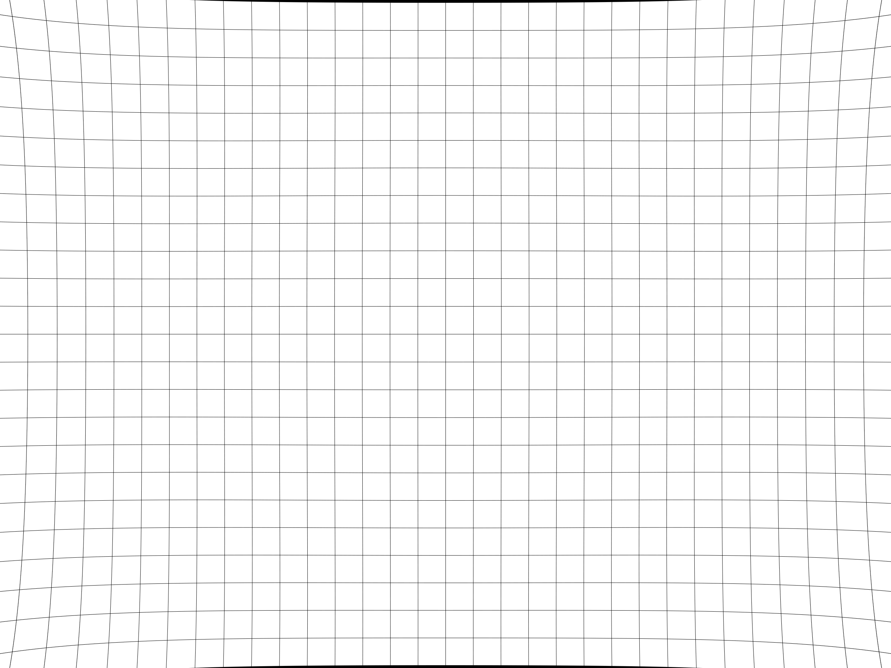
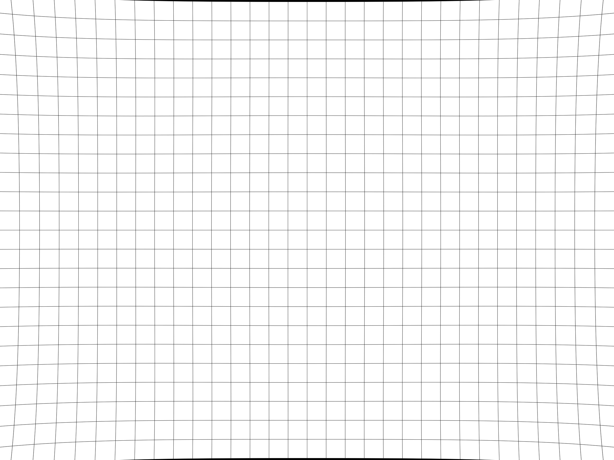
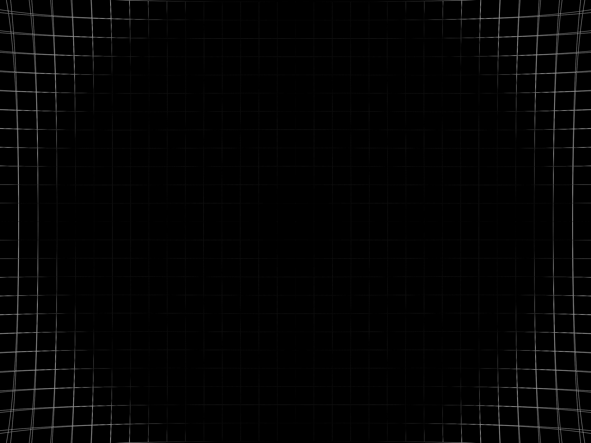

# Convert OpenCV k Undistortion Parameters to PTGui a, b, c, d Values

This script shows how to convert k1, k2, k3, k4 undistortion parameters used in OpenCV 
to a, b, c, d parameters used in PTGui.

Test image:

Test image undistorted by OpenCV using k parameters:

Test image undistorted by ImageMagick using a, b, c, d parameters estimated from k:

Difference between undistorted images:

